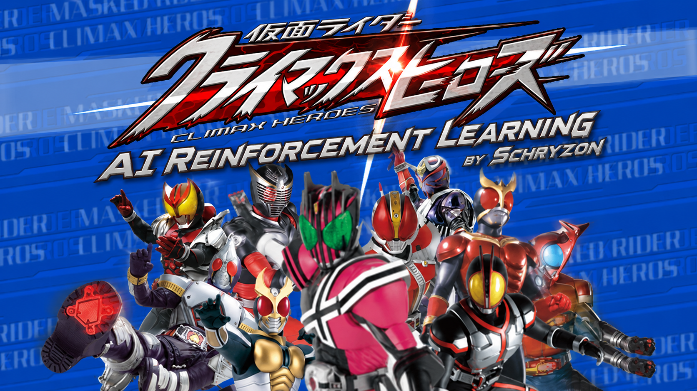

# Climax Heroes AI 🎮

<p align="center">
  
</p>

<p align="center">
  <a href="https://www.python.org/"></a>
  <a href="https://gymnasium.farama.org/"></a>
  <a href="https://stable-baselines3.readthedocs.io/"></a>
  <a href="https://pcsx2.net/"></a>
  <a href="https://github.com/ViGEm/ViGEmBus"></a>
  
</p>

A Reinforcement Learning environment wrapper designed to train AI agents to play **Kamen Rider: Climax Heroes (PS2)** on Windows using the PCSX2 emulator. It uses real-time screen capture for state observations and virtual controller emulation for input injection.

---

## Project Structure

```
Climax-Heroes-AI/
├── src/
│   └── env.py                # Custom Gymnasium environment wrapper
├── tests/
│   └── test_env.py           # Console dashboard test for real-time stats & rewards
├── tools/
│   ├── screen_capture_helper.py  # Visual HUD coordinate calibration helper
│   └── test_gamepad.py       # Virtual gamepad initialization tester
├── requirements.txt          # Python dependencies
└── README.md                 # Project documentation
```

---

## Prerequisites & Setup

### 1. Game & Emulator Setup
*   Run the game using **PCSX2**.
*   Configure the screen layout to **16:9 fullscreen (1920x1080 resolution)**.
*   The environment will automatically locate the game window if it contains the word `"仮面ライダー"` or `"Climax Heroes"`.

### 2. Virtual Gamepad Driver
This project emulates an Xbox 360 controller via the **ViGEmBus** driver.
*   Download and install the latest **ViGEmBus** installer: [ViGEmBus Releases](https://github.com/ViGEm/ViGEmBus/releases).

### 3. Installation
Install the required Python packages:
```powershell
python312 -m pip install -r requirements.txt
```

---

## Running & Verification

### Step 1: Test Gamepad Emulation
Verify that the virtual gamepad driver is running and importable:
```powershell
python312 .\tools\test_gamepad.py
```

### Step 2: Calibrate Bounding Boxes
Capture a test frame and verify that the HP (green/red), Guard Gauge (yellow), and Rider Gauge (blue) bounding boxes align perfectly:
```powershell
python312 .\tools\screen_capture_helper.py
```
This saves `game_capture_annotated.png` in the directory so you can visually verify the box alignments.

### Step 3: Run Environment Console Dashboard
Run the custom environment with random actions to see the real-time parsing dashboard (shows HP tracking across multiple color layers, shield gauges, meter changes, and reward computation):
```powershell
python312 .\tests\test_env.py
```

### Step 4: Run RL Model Training
To train the PPO model against the PCSX2 emulated CPU player:
1. Open PCSX2, go to **Vs Mode**, set **Player 1 = Player** (which our AI drives), and **Player 2 = CPU** (which the game drives).
2. Start the training script:
   ```powershell
   python312 .\src\train.py
   ```

### Step 5: Monitor Progress via TensorBoard
You can watch the reward curves and training metrics climb in real-time by launching TensorBoard:
```powershell
tensorboard --logdir ./tb_logs/
```
Then navigate to `http://localhost:6006` in your browser.

## State Extraction & Environment Specs

*   **Observation Space:** 4 stacked $84 \times 84$ grayscale frames (standard for Atari-like RL agents).
*   **Action Space:** 12 discrete macro actions (Idle, Walk Forward, Walk Backward/Guard, Jump, Attack combos, Special, Rider Finale, Evade, Meter Charge).
*   **Layered HP Tracker:** Detects HP from `0` to `300` across 3 stacks (Green $\rightarrow$ Yellow $\rightarrow$ Red) using HSV masks.
*   **Guard & Rider Gauges:** Tracked dynamically using grayscale column summation.
*   **Dense Reward Formulation:**
    *   $\pm$ HP Delta (dealing damage vs taking damage).
    *   $\pm$ Guard Gauge Delta (shield preservation vs crushing opponent's shield).
    *   $+$ Rider Gauge Delta (accumulating meter).
