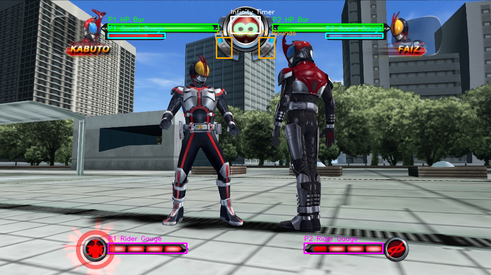

# Kamen Rider: Climax Heroes AI 🎮

<p align="center">
  
</p>

<p align="center">
  <a href="https://www.python.org/"></a>
  <a href="https://gymnasium.farama.org/"></a>
  <a href="https://stable-baselines3.readthedocs.io/"></a>
  <a href="https://pcsx2.net/"></a>
  <a href="https://github.com/ViGEm/ViGEmBus"></a>
  
</p>

A Reinforcement Learning environment wrapper designed to train **Hiyori**, a custom AI agent, to play **Kamen Rider: Climax Heroes (PS2)** on Windows using the PCSX2 emulator. It uses real-time screen capture for state observations and virtual controller emulation for input injection.

---

## Project Structure

```
Climax-Heroes-AI/
├── src/
│   └── env.py                # Custom Gymnasium environment wrapper
├── tests/
│   └── test_env.py           # Console dashboard test for real-time stats & rewards
├── tools/
│   ├── screen_capture_helper.py  # Visual HUD coordinate calibration helper
│   └── test_gamepad.py       # Virtual gamepad initialization tester
├── requirements.txt          # Python dependencies
└── README.md                 # Project documentation
```

---

## Prerequisites & Setup

### 1. Game & Emulator Setup
*   Run the game using **PCSX2**.
*   Configure the screen layout to **16:9 fullscreen (1920x1080 resolution)**.
*   The environment will automatically locate the game window if it contains the word `"仮面ライダー"` or `"Climax Heroes"`.

### 2. Virtual Gamepad Driver
This project emulates an Xbox 360 controller via the **ViGEmBus** driver.
*   Download and install the latest **ViGEmBus** installer: [ViGEmBus Releases](https://github.com/ViGEm/ViGEmBus/releases).

### 3. Installation
Install the required Python packages:
```powershell
python312 -m pip install -r requirements.txt
```

---

## Running & Verification

### Step 1: Test Gamepad Emulation
Verify that the virtual gamepad driver is running and importable:
```powershell
python312 .\tools\test_gamepad.py
```

### Step 2: Calibrate Bounding Boxes
Capture a test frame and verify that the HP (green/red), Guard Gauge (yellow), and Rider Gauge (blue) bounding boxes align perfectly:
```powershell
python312 .\tools\screen_capture_helper.py
```
This saves `game_capture_annotated.png` in the directory so you can visually verify the box alignments.

### Step 3: Run Environment Console Dashboard
Run the custom environment with random actions to see the real-time parsing dashboard (shows HP tracking across multiple color layers, shield gauges, meter changes, and reward computation):
```powershell
python312 .\tests\test_env.py
```

### Step 4: Run RL Model Training
To train the PPO model against the PCSX2 emulated CPU player:
1. Open PCSX2, go to **Vs Mode**, set **Player 1 = Player** (which our AI drives), and **Player 2 = CPU** (which the game drives).
2. Start the training script:
   ```powershell
   python312 .\src\train.py
   ```

### Step 5: Monitor Progress via TensorBoard
You can watch the reward curves and training metrics climb in real-time by launching TensorBoard:
```powershell
tensorboard --logdir ./tb_logs/
```
Then navigate to `http://localhost:6006` in your browser.

## State Extraction & Environment Specs

*   **Observation Space:** 4 stacked $84 \times 84$ grayscale frames (representing the last 4 frames at 30fps).
*   **Action Space:** 19 discrete macro actions:
    *   `0`: Idle / Guard (Blocks attacks)
    *   `1`: Walk Forward
    *   `2`: Walk Backward
    *   `3`: Jump (D-pad Up)
    *   `4`: Light Attack Combo (Xbox `X`)
    *   `5`: Heavy Attack Combo (Xbox `Y`)
    *   `6`: Special Move (Xbox `A` / 2 bars of meter)
    *   `7`: Normal Finisher (Xbox `B`)
    *   `8`: Rider Finale (Xbox `RT` / 5 bars of meter)
    *   `9`: Evade Left (Xbox `LB`)
    *   `10`: Evade Right (Xbox `RB`)
    *   `11`: Charge Rider Gauge (D-pad Down)
    *   `12`: Form Change (Xbox `LT` / 5 bars of meter)
    *   `13`: Attack Cancel Right (D-pad Double-tap Right / Cancel animation facing Right)
    *   `14`: Attack Cancel Left (D-pad Double-tap Left / Cancel animation facing Left)
    *   `15`: Running Light Attack Right (D-pad double-tap Right + hold + Weak Attack)
    *   `16`: Running Light Attack Left (D-pad double-tap Left + hold + Weak Attack)
    *   `17`: Running Heavy Attack Right (D-pad double-tap Right + hold + Heavy Attack)
    *   `18`: Running Heavy Attack Left (D-pad double-tap Left + hold + Heavy Attack)
*   **Continuous Episode Mode:** The environment is configured for continuous infinite-episode training (`terminated = False`, `truncated = False`). Resets are managed manually or through external emulation state resets, letting the AI train seamlessly across multiple matches.
*   **Persistent Gamepad Lifecycle:** Rebuilt using a persistent virtual driver lifecycle. The virtual controller remains connected throughout the entire Python process, preventing emulators (PCSX2/Dolphin) from losing Port 1 gamepad mappings.
*   **Multi-Gamepad Manual Takeover:** Scans all connected physical joysticks in real-time. Pressing any face button or D-pad direction immediately silences AI inputs for **4.0 seconds**, enabling seamless human takeover for manual positioning or resets.

### Detailed Reward Formulation

To guide policy optimization and prevent reward hacking, the environment utilizes a dense, risk-adjusted reward structure:

1.  **HP Damage Trade-offs:**
    *   **Damage Dealt:** `+1.0` per point of HP damage dealt.
    *   **Guard Broken Hit:** `+2.0` per point of HP damage dealt while the opponent is guard-broken.
    *   **Finisher Hit Bonus:** `+3.0` per point of HP damage + a flat `+25.0` bonus for landing a Rider Finale (Action 8).
    *   **Damage Taken:** `-1.2` per point of HP damage taken.
    *   **Missed Finisher Penalty:** `-15.0` penalty if a Rider Finale is attempted but deals `0` damage.
2.  **Shield & Guard Management:**
    *   **Shield Damage Dealt:** `+0.3` per point of opponent guard gauge reduction.
    *   **Guard Crush Bonus:** `+15.0` bonus for completely breaking the opponent's shield.
    *   **Successful Block:** `+0.20` per point of shield reduction if the AI blocks an attack without taking HP damage.
    *   **Failed Block:** `-0.15` per point of shield reduction if the AI is hit.
3.  **Special Meter (Rider Gauge):**
    *   **Meter Gained:** `+0.30` per unit of meter generated.
    *   **Form Change / Finisher Exploration:** `+5.0` one-time bonus for the first L2/R2 attempt when meter is full ($\ge 95.0$).
4.  **Dodge Cost:**
    *   **Evade Penalty:** `-0.08` per dodge action (Action 9 & 10) to penalize infinite dodge-spamming, forcing the AI to balance defense with active combat.
5.  **Combo Bonus:**
    *   `+0.1` per combo hit count to encourage chaining attacks.

### In-Game HUD Coordinate Mapping

To parse stats from the emulator, the environment checks specific boundary regions of the **1024 × 576** game window:

<p align="center">
  
</p>

| HUD Element | Normalized X-Range | Normalized Y-Range | Absolute X-Range ($1024 \text{px}$) | Absolute Y-Range ($576 \text{px}$) | Bounding Box |
| :--- | :--- | :--- | :--- | :--- | :--- |
| **P1 HP Bar** | `[0.220, 0.445]` | `[0.087, 0.113]` | `[225, 455]` | `[50, 65]` | **Green** |
| **P2 HP Bar** | `[0.555, 0.780]` | `[0.087, 0.113]` | `[568, 798]` | `[50, 65]` | **Green** |
| **P1 Guard Gauge** | `[0.220, 0.336]` | `[0.120, 0.138]` | `[225, 344]` | `[69, 79]` | **Cyan** |
| **P2 Guard Gauge** | `[0.664, 0.780]` | `[0.120, 0.138]` | `[679, 798]` | `[69, 79]` | **Cyan** |
| **P1 Rounds Won** | `[0.441, 0.472]` | `[0.137, 0.212]` | `[451, 483]` | `[78, 122]` | **Orange** |
| **P2 Rounds Won** | `[0.528, 0.559]` | `[0.137, 0.212]` | `[540, 572]` | `[78, 122]` | **Orange** |
| **Infinity Timer** | `[0.470, 0.530]` | `[0.060, 0.120]` | `[481, 542]` | `[34, 69]` | **White** |
| **P1 Rider Gauge** | `[0.220, 0.380]` | `[0.884, 0.921]` | `[225, 389]` | `[509, 530]` | **Magenta** |
| **P2 Rider Gauge** | `[0.620, 0.780]` | `[0.884, 0.921]` | `[634, 798]` | `[509, 530]` | **Magenta** |

---

## Training Expectations & Hardware Requirements

### Training Milestones
Reinforcement learning in fighting games requires significant exploration. Below are the expected milestones for Hiyori's training:
*   **100k steps:** Learns basic movement (walking forward/backward) and begins spamming basic attacks.
*   **500k steps:** Starts incorporating defense (guarding/blocking), manages special meter charging, and avoids hazardous states.
*   **1M+ steps:** Executes complex sequences, triggers form changes, and lands Rider Finales with strategic timing.

### Hardware Recommendations
*   **GPU:** Dedicated NVIDIA GPU (RTX 3050 or higher recommended for parallel CNN feature extraction).
*   **CUDA:** CUDA-enabled PyTorch configuration for high-throughput step processing.
*   **Emulator Performance:** A stable 30/60 FPS emulation rate in PCSX2 is **critical**. Frame drops or stuttering can poison the state representation (frame stacks) and degrade policy convergence.

---

## License & Contributing

*   This project is licensed under the **[MIT License](LICENSE)**.
*   Interested in contributing? Check out our **[Contributing Guidelines](CONTRIBUTING.md)** for coding standards, style guides, and workflow details.

---

## Disclaimer

This project is an independent, open-source research and educational endeavor. It is not affiliated with, authorized, sponsored, or endorsed by Bandai Namco Entertainment, Sony Interactive Entertainment, or any of their partners or subsidiaries. 

All trademarks, game content, character designs, and assets belong to their respective owners. No proprietary game files, ROMs, ISOs, or emulator BIOS files are distributed in this repository.


